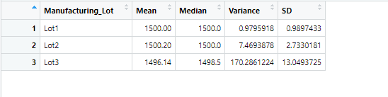

# MechaCar_Statistical_Analysis

## Linear Regression to Predit MPG

In the first analysis we are using the multi-line regression model.

From the summary above, the variables vehicle_length and ground_clearance have the most impact on the mpg.

The slope of the linear model is not a zero because or p-value is 5.35e-11 is smaller than our assumed singnificance level of 0.05%, in which we can reject our null hypothesis.

The linear model doesn't predict mpg of MechaCar Prototypes effectively because of the lack of significant variables.

## Summary Statistics on Suspension Coils

The second analysis we look look into the PSI.

From the summary we can see the only lot that exceeds variance of the suspension coils by 100 PSI is lot 3. In that case lot 3 does not meet the manufacturing data. 

## T-Tests on Suspension Coils

From our first t.test, with a p-value of 1 the PSI across all manufacturing lots is not statistically different from the population mean of 1,500.

The next 3 t.test we use subsets for each manufacturing lot to determine if the PSI is statistically different from the population mean of 1,500. Similary as our first test test we get a p-value of 1 in which case there is no statistic difference.

## Study Design: MechaCar vs Competition

### How will the MechaCar performs against the competition?

- We can merge data from other manufactures, in this dataset we only had a metric of AWD but we can look into more metrics with a bigger dataset. 
- We would need to test mpg(highway/city) and cost, as those are two metrics every buyer is looking at.

- We can use ANOVA to test the mpg and cost and different types of cars.

- Regardless of whichever type of ANOVA test we use the hypothese on an ANOVA are the same:
 - The null : the means of all groups are equal. 
 - The alternative : at least one of the means is different from all other groups.
 
- If we find a p-value that is smaller then our significance level then we can reject the null hypothesis and we can claim there is significant  differences in mpgs,costs between the manufactures. Therefore the MechaCar will good.

